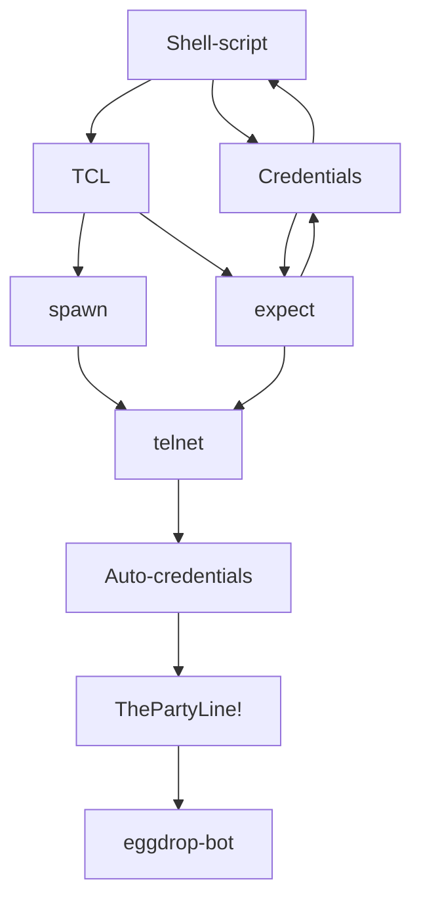

# 
Send Credentials Auto-Magically

### 
telnet bot.sh

⭕ See extended description above by pressing the three dots ... on the left-hand side.

> __Note__ The Shell script doesn't press Enter on that last .quit command either, so if you wanted to just .rehash, it's done automatically for you instantly.  The command .quit is sent to the text line; but without actually being sent out... I.E not triggering as a command - so now that it's there on the line, if you want to actually .quit-- if your only intention was to just rehash from The Party Line, you just press Enter yourself and quit - but! If you want to stay, you just backspace the .quit and issue whatever other commands you need to The Party Line!

> __Warning__ Tags: Shell-script-Credentials-Auto-credentials-send-spawn-telnet-eggdrop-bot-TCL-expect-ThePartyLine!

